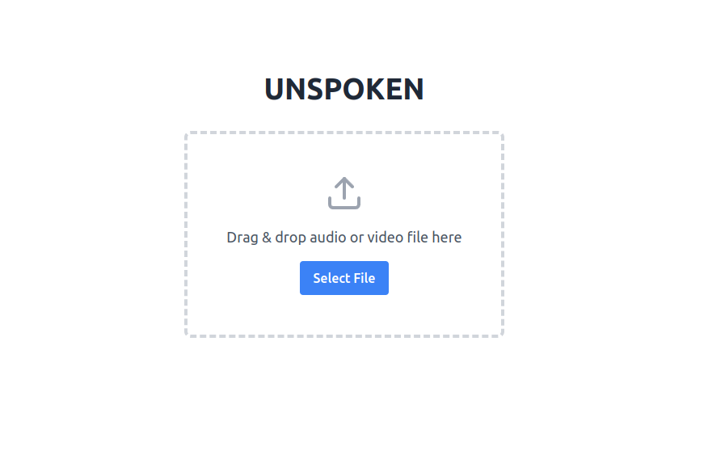
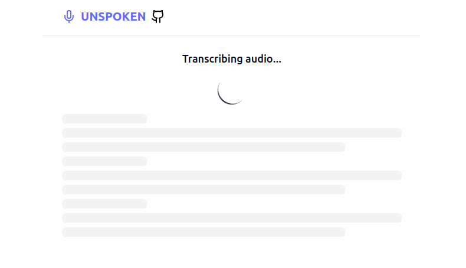
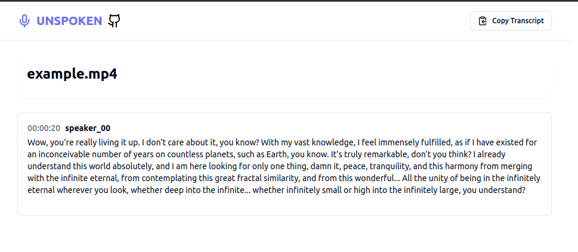

# UNSPOKEN

Convert audio to text-conversation separated by speakers.

## Table of Contents

- [Introduction](#introduction)
- [Features](#features)
- [Prerequisites](#prerequisites)
- [Installation](#installation)
- [Contributing](#contributing)

## Introduction

UNSPOKEN converts audio files to text conversations, labeled by speakers, using `faster-whisper` and `pyanote.audio`
diarization.

## Features

- Audio to text conversion
- Speaker diarization
- API and optional UI

## Prerequisites

- NVIDIA drivers installed

## Installation

1. Clone repository:
    ```bash
    git clone https://github.com/nuclearthinking/unspoken.git
    cd unspoken
    ```
2. Run application with docker compose:
    ```bash
    docker compose up -d
    ```

### Important!! Keep in mind that, on first run it will download large binaries models from huggingface, therefore it will take some time.

You can check progress using `docker log` command on app container. 







## Contributing

Contributions are wellcome! Please see our [CONTRIBUTING.md](CONTRIBUTING.md) for details.