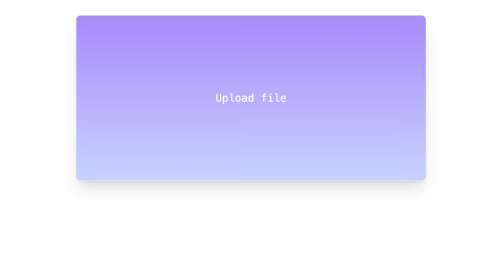
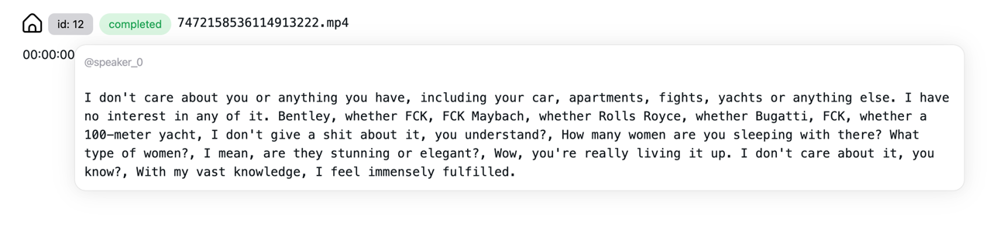

# UNSPOKEN

Convert audio to text-conversation separated by speakers.

## Installation
* You have to have installed nvidia drivers to be able to use this application. 
* You have to accept pyannote user conditions 
  * Accept [pyannote/segmentation-3.0](https://hf.co/pyannote/segmentation-3.0) user conditions
  * Accept [pyannote/speaker-diarization-3.1](https://hf.co/pyannote/speaker-diarization-3.1) user conditions
  * Create access token at [hf.co/settings/tokens](https://hf.co/settings/tokens).
* Put access token to .env file HF_TOKEN="your_hf_token"
* Build and run containers with docker compose.

```bash
docker-compose up -d
```

## Getting started

Upload file.

```bash
curl --location '0.0.0.0:8000/upload/audio' \
--form 'file=@"/home/user/audio_file.m4a"'
```

In response, you will receive task_id

```json
{
  "task_id": 21,
  "task_status": "queued"
}
```

Then call endpoint with received task_id, to see current task state

```bash
curl --location '0.0.0.0:8000/task/21'
```
After task were finished processing, it changes status to `completed` and result will contain array of transcribed
messages with data like timestamps and speaker.
```json
{
  "id": 21,
  "status": "completed",
  "file_name": "file_name",
  "speakers": [
    "speaker_0",
    "speaker_1"
  ],
  "messages": [
    {
      "start": 0.0,
      "end": 3.62,
      "text": "Message 1",
      "speaker": "speaker_0"
    },
    {
      "start": 6.959999999999999,
      "end": 15.0,
      "text": "Message 2",
      "speaker": "speaker_1"
    }
  ]
}
```

## Build frontend (optional)
UI interface is optional, you can use application with API interface. 

To build UI follow this instruction. 

Required dependencies `nodejs` 
* How to install node: https://nodejs.org/en/download/package-manager


How to build frontend:

I'm using bun javascript package manager
* How to install bun: https://bun.sh/ 

But it available with any other alternatives such as `npm`, `yarn` and others.
```bash
cd frontend/unspoken
bun install
bun run build 
```

Run frontend: 
```bash
docker compose --profile frontend up
```




Current accuracy of STT and Speaker Diarization is still not that good, but could be good enough for some purposes.

Based on [faster-whisper](https://github.com/guillaumekln/faster-whisper) and [pyannote-audio](https://github.com/pyannote/pyannote-audio) 
